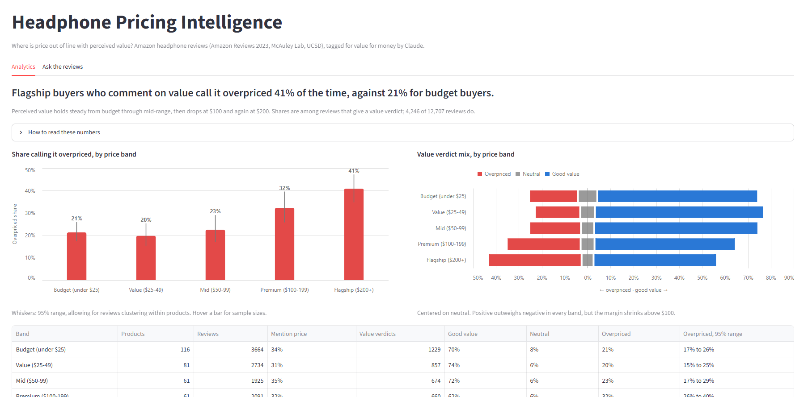
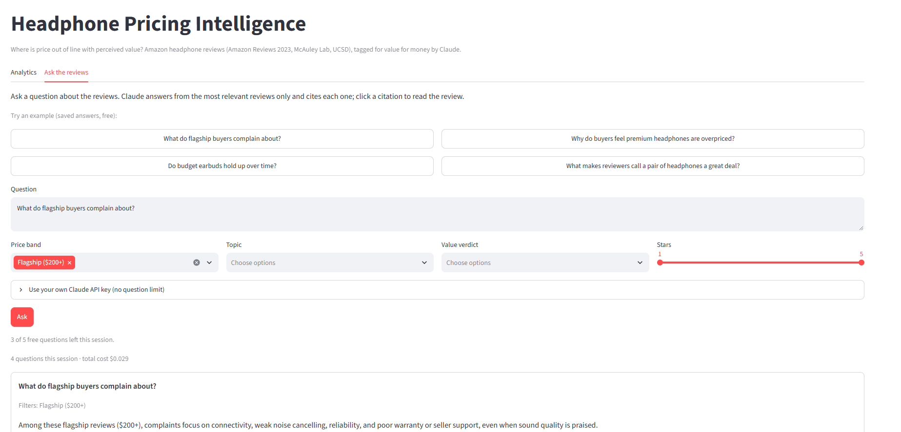
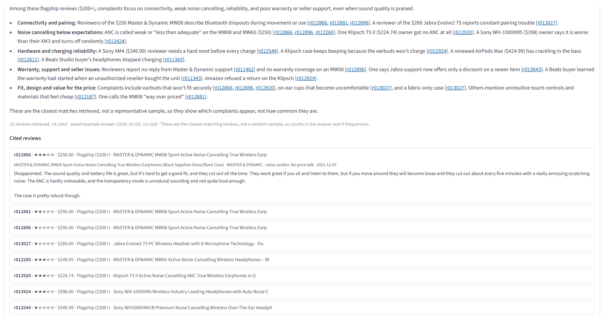

# Headphone Pricing Intelligence

**Where is headphone price out of line with perceived value, and what do customers say at each price point?**

An **LLM-powered pricing analysis** of 12,700 Amazon headphone reviews: Claude reads every review for what buyers say about value for money, and an app lets anyone explore the results and question the reviews directly.

**[Open the live app](https://llm-review-pricing-analysis.streamlit.app/)**

## The question

Pricing teams usually see what sells, not why buyers feel a price was or wasn't worth it. Reviews say why, but at a scale no one can read. This project asks, at the level of a whole category: **at which price points do buyers start to feel they overpaid, and what drives that feeling?** It treats price the way a portfolio would be managed, in bands from budget to flagship, rather than product by product.

## What the reviews say

Among reviews that comment on value for money, the share calling the product overpriced. The 95% ranges allow for reviews clustering within products: each band's products were resampled 5,000 times.

| Price band | Products | Reviews | Value verdicts | Overpriced | 95% range |
| --- | ---: | ---: | ---: | ---: | --- |
| Budget (under $25) | 116 | 3,664 | 1,229 | 21% | 17% to 26% |
| Value ($25-49) | 81 | 2,734 | 857 | 20% | 15% to 25% |
| Mid ($50-99) | 61 | 1,925 | 674 | 23% | 17% to 29% |
| Premium ($100-199) | 61 | 2,091 | 660 | 32% | 26% to 40% |
| Flagship ($200+) | 71 | 2,293 | 826 | 41% | 35% to 47% |

1. **Perceived value is flat up to $100, then drops twice.** Budget, value and mid-range buyers call their headphones overpriced at the same rate, about 21%. The share rises to 32% above $100 and 41% above $200: flagship buyers who talk about value are about twice as likely as budget buyers to say it wasn't worth it.
2. **Above $100, buyers stop judging sound and start judging reliability.** Satisfaction with sound quality rises steadily with price, and durability complaints fade. But dropped connections and poor customer service turn sharply negative at flagship prices: the very problems buyers are paying a premium to avoid.
3. **34 products are priced above their band's typical price and draw more "overpriced" verdicts than their band average;** for 15, the gap holds up even allowing for small samples. The app lists them with the reviews behind each one.
4. **Listed prices had to be checked before they could be trusted.** 39 of 429 sampled listings were set aside: reseller markups (a ~$20 Sony earbud listed at $803), items that weren't headphones, and multi-packs. Removing them raised flagship's overpriced share from 38% to 41%; the mispriced listings had been diluting the real signal.

**What this suggests for pricing:** below $100, reviews show no value penalty for charging more within the range, so price can follow features. Above $100, a higher price has to be backed by reliability and support, not better sound alone: sound is already where flagship buyers are happiest, and the complaints that drive "not worth it" are dropped connections and poor service.

## Ask the reviews

The second tab answers questions in plain language ("What do flagship buyers complain about?"), filtered by price band, topic, verdict or star rating. Every answer cites the reviews it draws on, and each citation opens the review itself, so nothing has to be taken on trust.

## How the project ran

| Phase | What was done | What was learned or decided |
| --- | --- | --- |
| 1. Scope and data | Framed the question as category-level pricing strategy. Chose real Amazon reviews over synthetic ones, and sampled products across the full price range. | The first pull matched the word "headphone" and was nearly 60% cases, cables and ear pads. Filtering by Amazon's category instead fixed it. |
| 2. AI reading of reviews | Claude read every review for its value-for-money verdict and the topics it raises. | A hand-check of 50 reviews found 96% accuracy on value verdicts. A built-in consistency check then caught errors the hand-check missed; without it, the "overpriced" share would have been overstated. |
| 3. Search and Q&A | Made the reviews searchable and had Claude answer questions with citations. | Equal-sized price groups lumped $80 gaming headsets with $999 audiophile gear, so the analysis moved to dollar bands the way the category is merchandised. Flagship was too thin (18 products), so targeted extra pulls deepened it to 88; after the price check in Phase 4 set aside 17 bad listings, 71 remain in the statistics. |
| 4. Price check and app | Had Claude estimate each product's normal price to catch bad listings, then built the app. | Claude's own judgment flagged prices only 10% above normal, so the cutoff (2x) became a fixed rule. "Should be a $10 item" is an opinion, not a price, so complaints don't count as evidence: otherwise the check would erase the very signal being measured. Close calls were decided by hand. |
| 5. Publish | Checked the data's terms, added safeguards to the public demo, deployed. | The dataset grants no explicit right to redistribute review text, so this repository holds code only. The demo caps questions per visitor and runs on a spend-limited key. |

All of it cost under $6 in AI usage. The [project log](PROJECT_LOG.md) has every decision, issue and fix, with costs and validation results.

## How this was built

The project follows a repeatable method for AI work, written up as **[a playbook](PLAYBOOK.md)**:

- **Start in conversation, move to an AI coding agent for the heavy build.** Scoping, the analysis plan and Phases 1-3 (data, AI reading of reviews, search) ran in conversation with Claude. The price check, the app and deployment, which needed many build-test-fix cycles, moved to Claude Code, handed off through a written brief ([`CLAUDE.md`](CLAUDE.md)) covering the purpose, rules and next steps.
- **Pilot before spending, check before scaling.** Every AI step ran on a small sample first, with its cost and results reviewed before the full run, and its output was checked against human judgment.
- **Keep a decision log.** [`PROJECT_LOG.md`](PROJECT_LOG.md) records what was done, what went wrong and what changed as a result. It doubles as the handoff between work sessions.

## Data and limitations

The reviews come from **Amazon Reviews 2023**, a public research dataset from the McAuley Lab at UC San Diego ([dataset](https://huggingface.co/datasets/McAuley-Lab/Amazon-Reviews-2023); Hou et al., *Bridging Language and Items for Retrieval and Recommendation*, [arXiv:2403.03952](https://arxiv.org/abs/2403.03952), 2024). Out of respect for the source, this repository doesn't re-host the review text: the app loads its working copy from separate storage, shows short excerpts attributed by review ID, and anyone can rebuild the sample from the original dataset with the included pipeline. A non-commercial portfolio project, not affiliated with Amazon or the McAuley Lab.

- **Reviews, not sales.** The overpriced share measures what reviewers say, among the third who comment on value. It isn't a measure of demand or price sensitivity.
- **Prices are a single snapshot**, with no price history; what a reviewer paid can differ from the listing.
- **A sample, through September 2023:** 429 products, deliberately deeper in the higher bands, so results are reported per band.
- **AI tags are good, not perfect:** about 96% accurate on value verdicts in the hand-check, lower on topics.

## For developers

Setup, the pipeline, commands, deployment and the full citation are in **[docs/TECHNICAL.md](docs/TECHNICAL.md)**.
